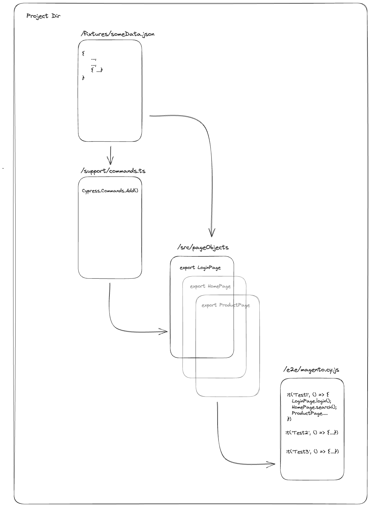
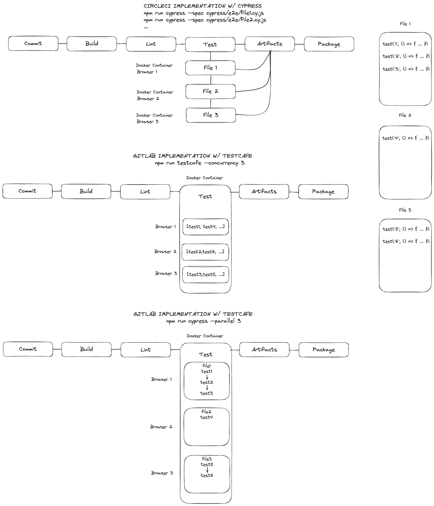

# Introduction

This project uses Cypress version 12. It is written in Typescript, using the Page Object Model via Classes paradigm.

Some notes about this structure.

1. Cypress does not encourage or advocate the use of POM. While not impossible to achieve, the design, promise resolve mechanism and variable assignment, lends itself well to just writing straight Cypress actions into your test handlers.
[Start Using App Actions](https://www.cypress.io/blog/2019/01/03/stop-using-page-objects-and-start-using-app-actions#page-objects-problems)
[Can I User The Page Object Pattern](https://docs.cypress.io/faq/questions/using-cypress-faq#Can-I-use-the-Page-Object-pattern)

2. Cypress uses the mocha implementation as a test runner, and so scaling of test suites is strictly limited to CI runner splitting tests on a per file basis. Within a file however, tests run sequentially. This means instances of a page `let page = new Page()` should not conflict data wise.

3. Alias'ing `@` is the way to pass values around in Cypress, instead of using `const, let, var` and avoiding the use of `return` statements; the use of these keywords is generally reserved for within a callback function like `then((a) => let b = a.text)`

4. Alternatives for sharing state could be explored through the use of Class fields and resetting them after test runs. This method has not be tried or implemented yet. To be explored.

5. A factory class / wrapper may be developed that newly instantiates all classes in a beforeEach hook. Note however it appears state is not shared between **beforeEach()** into the **test()** functions. The use of *this* keyword appears to be the solution to sharing state


## Project Setup

Tests are stored within

`/cypress/e2e/magento`

Page Objects are found in

`/cypress/src/pageObjects`

Extending Cypress object **cy.addFunction()** with custom commands is found in

`/cypress/support/commands.ts`


## Cypress Version
Cypress version updated from version 12.0.0. to 12.1.0 due to `cy.getAllCookies` failing. Bug was fixed as per [ticket](https://github.com/cypress-io/cypress/issues/8956)

## Running Tests

Tests can be found in `/cypress/e2e/magento` 

To run tests headless use the command `npm run test:headless`

## Structure Of Project

See below how files are inherited into the POM model



## CI & Parallel Considerations

The considerations for how to scale tests in CI, lies in the the test tool features and the test nners capabilities. The diagram shows and compares two test tools with two CI runners.

Cypress employs the use of Mocha as its test runner to leverage the inbuilt hooks and handling of it's core logic to execute and report on results. Testcafe as an example uses it's own inbuilt runner to handle its execution logic. These lead to different conclusions when it comes to testing. Refer to the diagram for the discussion.

1. Scaling Flags -p / -c

- Mocha has a `--parallel` flag, which distributes tests based on files, and therefore runs `it()` test functions **sequentially** in those files. This means you can share an instance and it won't pollute via race conditions.

- Testcafe has the `--concurreny` flag which reads `test()` functions off a queue, and therefore is not concerned with how files are distributed. This means you cannot share test state without running the risk of suffering race conditions.

2. Test State

- Mocha shares values via `@` aliases. Class fields and globals are another way you can set state and override state, while safely knowing that streams won't cross and sequential test runs ensure safety in tests

- Testcafe shares state via it's context option `t.ctx`, and each `test()` will use a unique test handler state behind the scenes. Therefore two `t.ctx` references will not be the same when running concurrent tests. This however does not safeguard you from assigning to global and referencing this in your context handlers

3. Splitting By Jobs vs Containers

- Jobs with most CI runners, will host a docker container from within, which will install all relative packages and files to execute. How you model your jobs in the pipeline is dependent on the resource volume assigned to your CI project. Refer to the diagram for the different modelling options

- Hosting a single large instance with docker running that can scale X number of browsers is an option

- Running multiple jobs with smaller docker instances internally is also an option. Just ensure you assign specify which files to run in each otherwise they may all run and you duplicate the work, with no benefit of scaling.

- There are options to use a CI's templating to also split tests up with parallel flag that don't rely on the test tools logic. Again a decision based on team or business setup. 



### Answers To Questions
PART 2: 

Answer the following Questions by adding in your Response next to the word “Answer” in Bold: 

S1: You have a suite of Cypress tests that take a considerable amount of time to run sequentially. The goal is to reduce the overall test execution time by leveraging parallel execution. 

What considerations would you keep in mind regarding test dependencies, resource allocation, and reporting? Answer: 

It depends on the test runner in question. In terms of 

How would you ensure the stability and reliability of the tests when running them in parallel? Answer:

**I tend to employ a number of tricks like awaiting for certain conditions to resolve before moving onto another action. Most test suites have good waiting mechanisms, but asserting that certain elements are visible first or clickable tends to avoid race conditons. You can also add in a slow down of test execution by say 5% or 10%, and this tends to maintain good test speed, while avoid race conditions.**

S2: Take me through a Scenario that you have worked on before, where you have detected anti-patterns. Answer:

**I once inherited a test suite that had hard coded wait statements among nearly every interaction on the page. This was a on a single laptop only, running locally and it took approximately 8 hours to complete and report back to the team.**

**Another scenario I've seen is the use of a lot of conditional statements to determine what logic paths to follow in the test suite. This was a major red flag, as it tells me that a user doesn't know what path they are testing in the system, as they rely on 2 or more states of the system to first resolve before proceeding. Instead of forcing test state, they allowed the system to choose which path it wanted to take.**

**N.B. this is different from the pattern I employ below, which forces the system state. The evaluation is immediately true or immediately false, and does not rely on arbitrary system state to play 'choose your own adventure'. These conditions generally require the system to meet and assertion criteria, otherwise it fails, and provide a form of stability to the tests.**

```JS
addToCart({verifyPage = false}: Options) {
    if(verifyPage) {
        // Avoid race condition of duplicate 'Add to Cart' options on multiple pages
        cy.url().should('not.contain', 'catalogsearch/result')            
    }

    cy.contains('Add to Cart').click();
    cy.url().should('not.contain', /\.\*.html/);
    }

...

addToCart({verifyPage: true}) // forces assertion to first resolve
```


Can you explain some anti-patterns you have come across in those codebases that you've worked on, and explain the techniques you have used to improve the codebase? Answer:

**As mentioned above one of them involved the use of if-else statements. These were littered all throughout the test codebase. Improving this generally invovles:**

1. waiting for the system state to resolve to your expected condition, generally with 

    `expect(someCondition).to.resolve(toExpectedCondition)`

    these are often promise based function calls, and so help to wait for some logic to update.

2. forcing the system state with API calls or seeding the DB. This ensures the test data you require is available before reaching the test logic in question.

    Below is an example of an antipattern I once employed as part of my state management for front end tests. This pattern worked in Cypress using CircleCI but not in Testcafe on Gitlab due to the combination of the **test tool and CI** memory management.

```JS

// mutatable global var
let token = null;

const apiClient = {

    get: async() => {

        try{
            if(token === null || token === undefined) {
                console.log('token not detected, setting token')
                let token = await authenticate();
                jwt = token;
            }
    
            // ...code here

        }
    }

    // ... post: () => {}
    // ... put: () => {}
    // ... delete: () => {}
}

```

**The above code when run in parallel through a test tool like Testcafe, will share that single state of **token**, and as one test updates that record, it will wipe the previous states token away, causing authentication errors on a network call.**


What specific techniques or strategies would you employ to identify anti-patterns? Answer:

**If doing code reviews I can generally see before a merge when an antipattern is emerging. If I'm not the funnel that stops code merges, then I would employ code scans potentially and have them check the number of wait statements employed, check perhaps conditional statements, although this can be harder, due to if-else being keywords in a language, rather than a test tools function that is uniquely named. Linters generally help with this.**

Once you identified the anti-patterns, how did you prioritize and categorize them based on their impact on the Test Suite? Answer:

**I don't have an answer for this sorry. I tend to keep them in the back of my mind and leave them be if they run fine. If they are detrimental to the test suite then they become the primary focus to fix before anything else gets done.**

How would you go about refactoring or improving the tests to eliminate the identified anti-patterns? Answer:

**I don't have a method for this, as the patterns have shown themselves differently in each jobs based on the tool in use. I tend to experiment and iterate, using the repl to display small samples of code patterns I'd like to achieve, based on the shape of data I would like, or some ideas I have. Unfortunately I don't have hard and fast rules around this**

What steps would you take to make the tests more maintainable, independent, and reliable? Answer:

1. **Ensure promises / async is used to resolve before proceeding with next step**

2. **Employ expect assertions as part of a promise lib, to avoid race conditions**

3. **Employ back end calls to see the backend and ensure I have necessary data before proceeding**

4. **Ensuring I use unique id's to avoid sharing test state and record. Generally by using something like uuid or faker libs to generate unique records**

5. **Sometimes slow test execution down by 5 / 10%. This is merely to slow drag and hover + click / type events to give the system time to resolve for race conditions**

6. **Avoid using a single source of shared data in memory and updating it for other tests to use.**

7. **For CI run I'd add a retry flag, but ensure my tests are small enough to avoid a larger than necessary doubling of test time. A 2 minute test if it failed near the end an reran would take 4 mins. A 3 min test on fail-retry could turn into 6.**

8. **Avoid large scale e2e tests. Run then as smaller components and use API to handle test state creation to save on time like by creating records through click events.**

How would you ensure that the refactored tests still provide adequate test coverage and effectively validate the application's functionality Answer:

**I found with a couple of quite large refactors I've done, that my tests actually provide the basis for me to check their effectiveness. My test forms part of a living documentation standard, constantly reflecting current system state. If the code changes I see very quickly that it has failed with broad coverage.
This allows me to make miniscule changes and run broad sweeping tests, and know immediately if the current changes have caused failures, with the ability to compare to a previous run.**

**On a refactor I did at a previous company, I worked on using environment variables via CLI to determine if we pointed the test suite at QA or DEV environments to run. We saw no downtime with this refactor, as we had tests continually running in QA, and once we worked out how to map a single state environment variable naming convention into a nested object structure, it was a matter of running the update on my local branch, monitoring if failure rates increased, and then eventually put it into CI. It was actually matter of just 'turning it on'. This refactor, while quite invovled, ran very well and tests didn't fail except for a missing env variable. Everything else passed as previously.**

Considering the team's productivity and efficiency, how would you balance the effort required for anti-pattern remediation with ongoing feature development and bug fixing? Answer: 

**If the test system is built well, you can generally leave the current state running in CI and reporting, while you work on remediation.**

**If the team is very small like only one or two members, I would generally get test coverage high enough first, then assign one member to continue with feature development, while I worked on refactoring / tackling bugs.
If it is just myself, I would determine first the frequency of test failures, the percentage and then decide if I jumped into bug fixing first, or can safely build more features that provide test coverage - especially if the bugs are trivial, are known and are awaiting a dev fix.
For refactors, again this is a case by case basis, based on the urgency of coverage vs improving something we need.**

S3: At Winning Group, you will be required to set up a Bamboo Instance with Infrastructure and Developer Team help to execute the Tests on a per Build Basis, using your Test Source Code Repo in Bitbucket.

Note: If your experience is mainly in other CICD solutions like GitLab, Jenkins, CircleCI, TeamCity

How would you configure the Branch? Answer:
** Please refer to diagram above for the different options I have listed to running tests in CI. The way they are configured is dependent on the test tool in use and how it reads files / tests in a queue to run.**

**It depends on the resource allocation of the container provisioned for my branch. I've had Gitlab branches with quite large memory allocations, that allowed me to simply pass in a `--concurrency=x` or `--parallel=y` flag and let the test tool handle the relevant number of test instances / browsers I need.**

**I have also had other experiences in say CircleCI where I had essentially t2.micro instance partitioned and had to bring up multiple individual docker containers each hosting a single browser (up to 25 at the time).**

**It also comes down to the test tool. In testcafe one can simply determine the concurrency and each test will get popped off the queue when ready and run in the next available browser resource. Cypress however runs tests on a per file basis, and so depending on the number of `it()` statements you have, will determine the lenght and run of your test. At this point provisioning either a single job to that file, or breaking the file up into smaller tests would be my approach.**

**Further to this I would ensure my base image layers had thing like screen recording, screenshots for debugging installed. I would also direct my test failures and reports to an artifacts location for viewing.**

**For devs to safely consume my test code in master, this would be passing first. It helps narrow down if their source code has regressed or if they have updated say a web element and my test code is behind. If teams wanted a shift left approach, then my test code would be bundled as a package / module. Teams can them import this into their codebase and run against a locked down version and see their changes against a stable test system.**
**If teams are more fluid and dynamic, or if the team is not mature enough for shift left, I would allow them to either kick off a master test branch to check their results, or ensure I create a tagged version they can kick off to run their pipelines.**


What are the Steps needed to successfully execute the jobs on the CI/CD setup, and display the results? 
Please focus your answer on running the Tests on a Scheduled Basis, and then on a Per Build Basis. Also, take us through Step By Step details on how you would configure your Job Plan (or similar), and what Triggers you would add (or similar). Answer:

**For a scheduled basis, generally a CRON job configuration in the yml file, or the CI runner UI.**

**Per build basis, I'd link up dev pipelines and code repositories to reference my test suite and kick off from master. Or if they wanted a stable version, these can be created as tags; depending on how many teams are pushing code to an environment, this may be a bit harder due to the nature of constant updates and changes, that cause a tagged version to fall behind and fail.**

Within the Configuration Plan/Pipeline (or similar), what kind of Tasks would you create? Answer: